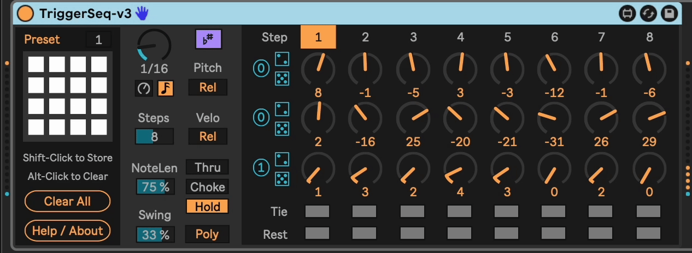

# TriggerSeq

A performance-oriented sequencer that is triggered by incoming MIDI notes.

Thanks to Kevin F. for the original idea and for pushing me farther into what is shaping up to be a really cool and useful little tool.

Now with polyphonic support, chuck your chords into the TriggerSeq to see what comes out the other side.

Use it with a monosynth like a 303 clone and dig into the new Tie function to slide up and down octaves from step-to-step.

Store 16 presets and and recall them with a parameter knob, enabling a different kind of live performance.

## Features
- Incoming notes trigger a sequence
- `Play Mode` control
    - `Thru` = Note-on triggers the sequence to play until the end. New note-ons do not interrupt a currently playing sequence.
    - `Choke` = Note-on triggers the sequence to play until the end. New note-ons _do_ interrupt a currently playing sequence.
    - `Hold` = Play the sequence as long as notes are held. It will loop when it reaches the end.
- `Pitch` can be absolute or relative
  - Scale awareness optional
- `Velocity` can be absolute or relative
- Rests are supported (non-playing pattern slots)
- `Time` can be notes or ms
- Slot `Duration` is multiples of a time base
- `Swing` control (-95% to +95%)
- `Mono` or `Poly` operation (8 voice support)
- `Tie` function to work nicely with 303s and other monosynths with portamento
- 16 automatable snapshot presets

## Installation

[Download the newest .amxd file from the latest release](https://github.com/zsteinkamp/m4l-TriggerSeq/releases) or clone this repository, and drag the `Project/TriggerSeq.amxd` device into a track in Ableton Live.

## Changelog

- 2025-03-32 [v3](https://github.com/zsteinkamp/m4l-TriggerSeq/releases/download/v3/TriggerSeq-v3.amxd) - Added Hold mode; Extended Swing to +/- 95%.
- 2025-03-22 [v2](https://github.com/zsteinkamp/m4l-TriggerSeq/releases/download/v2/TriggerSeq-v2.amxd) - Mono / Poly mode, Tie attribute, Presets.
- 2025-03-20 [v1](https://github.com/zsteinkamp/m4l-TriggerSeq/releases/download/v1/TriggerSeq-v1.amxd) - Initial Release.

## TODOs

- ...
